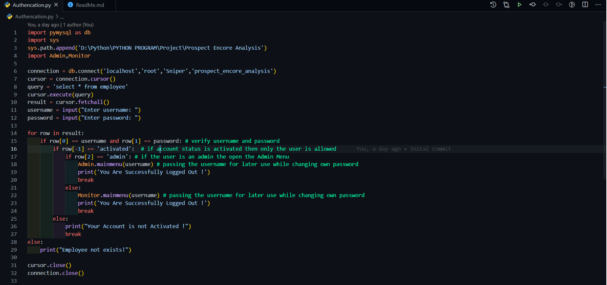

#  Prospect Encore Analysis

## Instruction for Setup

#### Step 1) First of all go inside of Authencation Module

#### Step 2) Make sure you setup the path by passing your path inside of sys.path.append('D:\Python\PYTHON PROGRAM\Project\Prospect Encore Analysis')
        import sys
        sys.path.append('D:\Python\PYTHON PROGRAM\Project\Prospect Encore Analysis')

#### Step 3) Run the following command in your terminal
        pip install pymysql==0.10.1
  
##  Built With:

#### Python
#### MySQL

 

##  ScreenShot of Admin and Monitor Menu 

 
