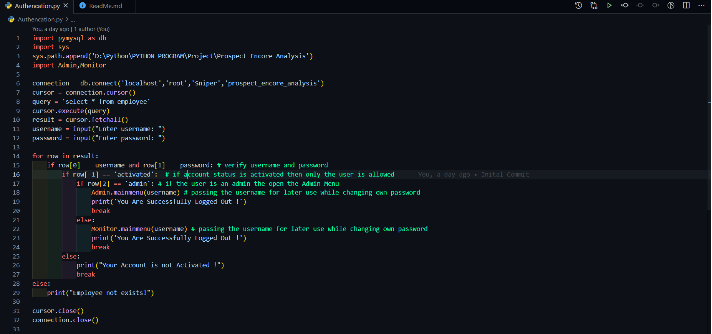

#  Prospect Encore Analysis

## Instruction for Setup

#### Step 1) First of all go inside of Authencation Module

#### Step 2) Make sure you setup the path by passing your path inside of sys.path.append('D:\Python\PYTHON PROGRAM\Project\Prospect Encore Analysis')

<video width="99%" height="540" autoplay loop muted markdown="1">
    <source src="./Instruction/PATH.mp4" type="video/mp4" markdown="1" >
</video>

#### Step 3) Run the following command in your terminal
##### pip install pymysql==0.10.1

<video width="99%" height="540" autoplay loop muted markdown="1">
    <source src="./Instruction/pymysql.mp4" type="video/mp4" markdown="1" >
</video>

 
  
##  Built With:

#### Python
#### MySQL

 

##  ScreenShot of Admin and Monitor Menu 

 

